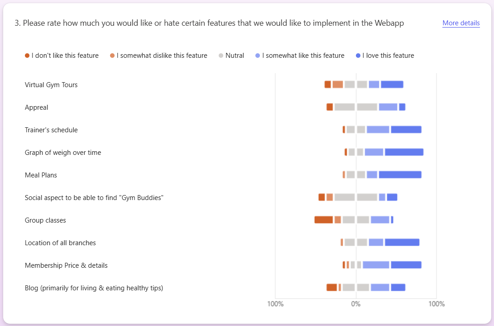
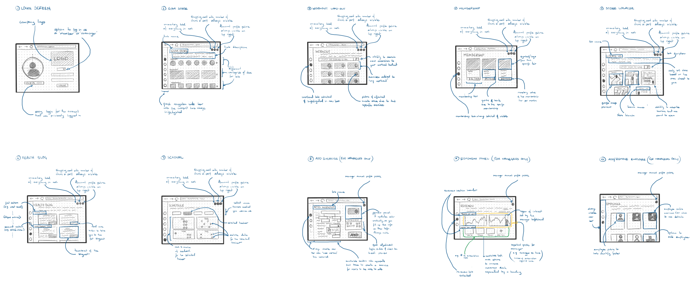
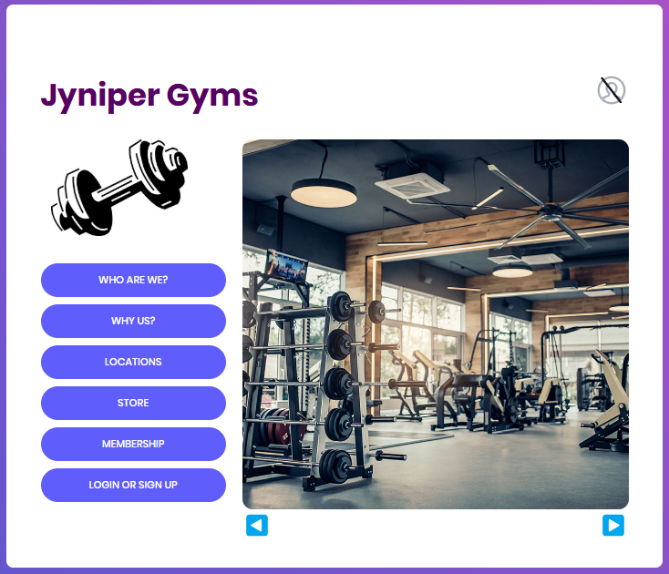
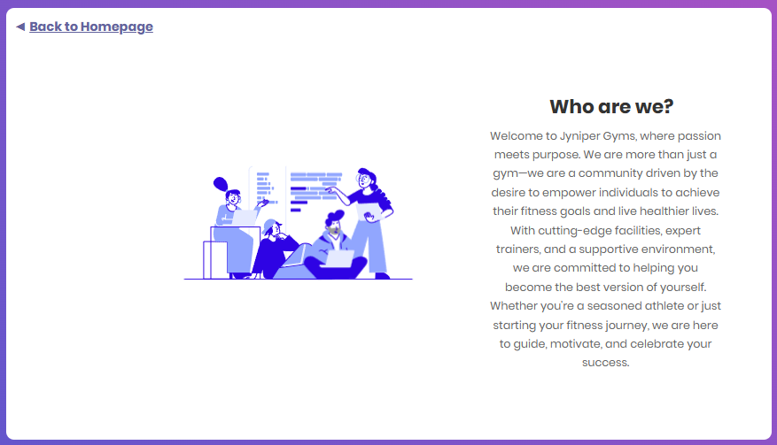
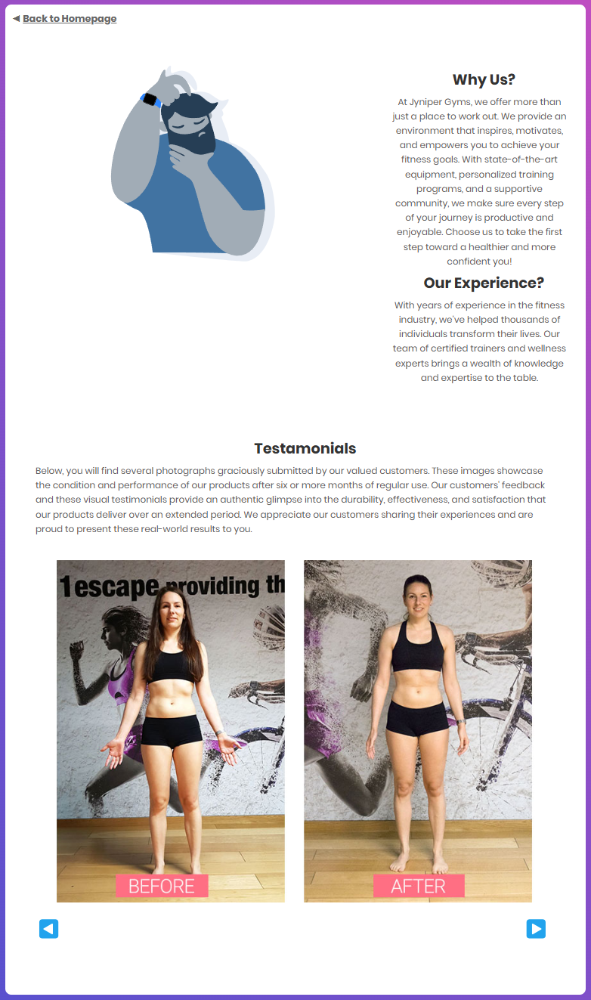
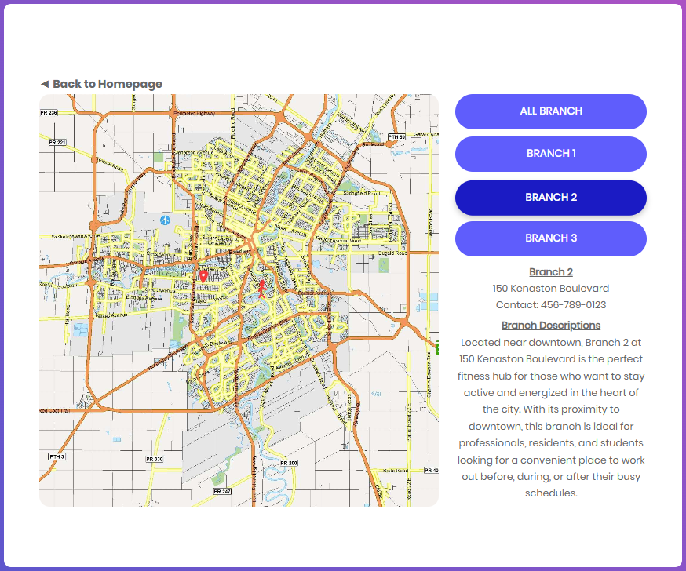
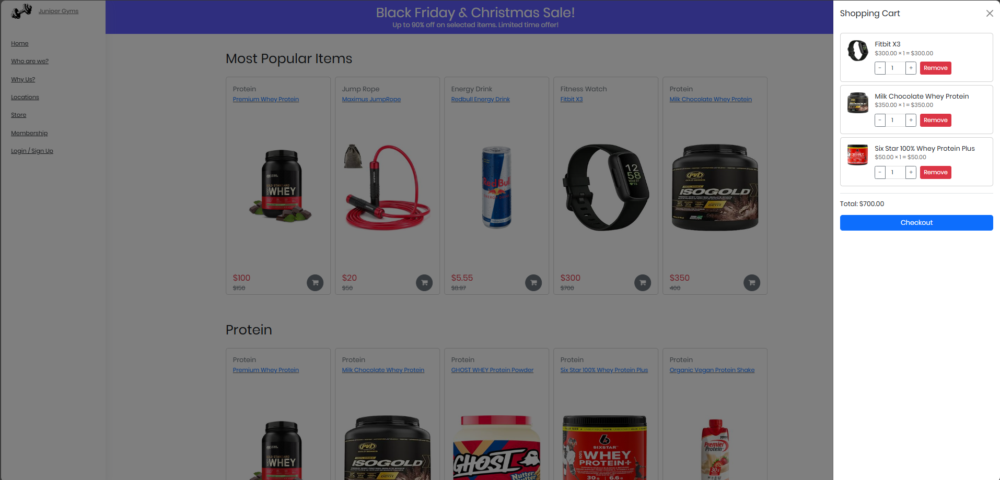
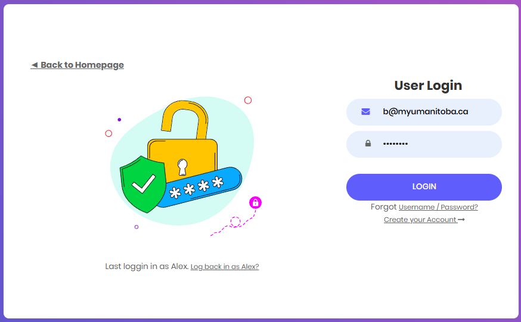
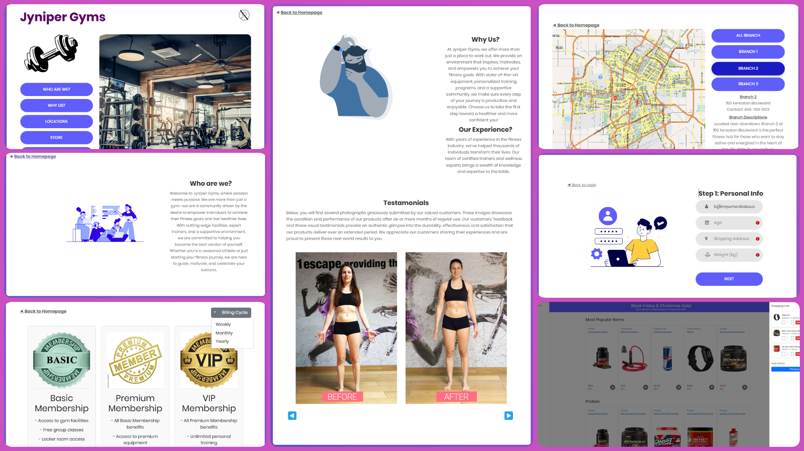

# JyniperGyms

## Description
JyniperGyms is an intuitive web application designed to simplify your gym experience. This project is part of an HCI (Human-Computer Interaction) class to demonstrate user-centric design and development principles.
## Investigation
During the investigation phase, we conducted thorough research to understand the features that our target users desire. Utilizing IDEO's human-centered design methodology, we engaged in user interviews, surveys, and observational studies. This approach allowed us to gather in-depth insights and preferences directly from potential users. Below are some of the most significant pieces of feedback we received:

## Paper Prototype
In the initial design phase, we created detailed paper sketches that served as the foundation for the website's user interface. These sketches allowed us to visualize and iterate on our ideas quickly before moving into digital prototyping. Here are the initial paper sketches that guided the creation of the website's design:

## Final Product
- **HOME**
The landing page of the site is designed with simplicity and minimalism in mind to ensure a modern and user-friendly experience. This page immediately introduces users to the essence of JyniperGyms, offering a clean interface that directs attention to key features and easy navigation options. By focusing on a streamlined design, we aim to provide a pleasant first impression and make navigation intuitive right from the start.
<!--  -->

- **WHO ARE WE?**
This section gives users insight into the mission and values of JyniperGyms. It highlights our commitment to promoting health and fitness, and provides background information about the team and our journey. By sharing our story, we build trust and connection with our users, helping them understand who we are and why we are passionate about what we do.
<!--  -->

- **WHY US?**
Here, we outline the unique benefits and features that set JyniperGyms apart from other fitness options. This section emphasizes the quality and variety of our facilities, our customer-centric approach, and the added value we offer through our services. The goal is to persuade potential users why choosing JyniperGyms is a smart and beneficial decision for their fitness journey.
<!--  -->

- **LOCATIONS**
The Locations page allows users to find our gym locations easily. It includes an interactive map and search options to help users locate the nearest gym or choose a gym in a specific area. This functionality is crucial for convenience and accessibility, ensuring users can quickly find a gym that suits their needs.
<!--  -->

- **STORE**
Our store page offers a variety of membership plans, gym equipment, and accessories for purchase. Users can compare different membership plans to find the one that best fits their needs and budget. This section also showcases our merchandise, promoting a sense of community and brand loyalty among our users.
<!--  -->

- **LOGIN OR SIGN UP**
This section is dedicated to user authentication. It provides a secure and straightforward interface for users to log in or create a new account. By making the login and sign-up process easy and accessible, we ensure users can quickly access personalized features and benefits.
<!--  -->

## Acknowledgments
- **Instructors and Classmates**: For their guidance and feedback throughout the project.

